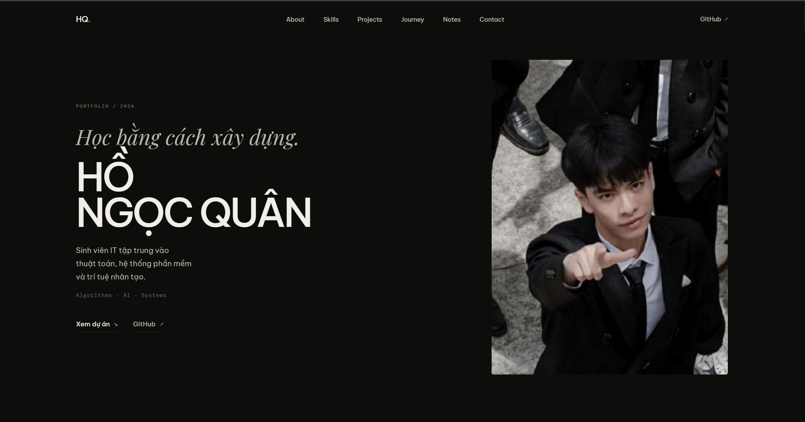
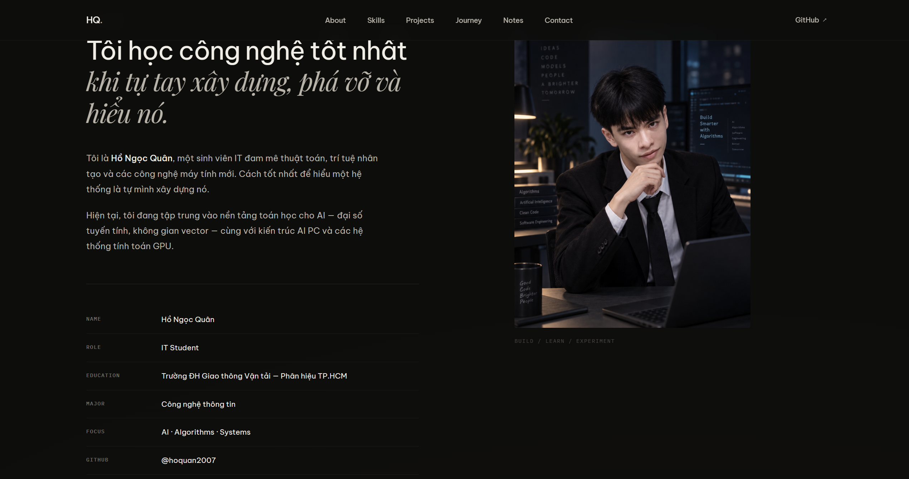

# web-ca-nhan-demo

Portfolio cá nhân của **Hồ Ngọc Quân** - sinh viên IT với niềm đam mê thuật toán, trí tuệ nhân tạo và hệ thống phần mềm.

## Giới thiệu

Đây là dự án **Bài Tập 4** trong khóa học, xây dựng một portfolio website hiện đại với:

- Thiết kế responsive, tối ưu cho mọi thiết bị
- Giao diện dark theme với hiệu ứng glass morphism
- Animations mượt mà với CSS và Intersection Observer
- Semantic HTML và accessibility tốt
- SEO-friendly với meta tags đầy đủ

## Các trang chính

| Trang | Mô tả |
|-------|-------|
| **Home** | Trang chủ với hero section ấn tượng |
| **About** | Giới thiệu bản thân và mục tiêu |
| **Skills** | Kỹ năng kỹ thuật với progress bars |
| **Projects** | Danh sách dự án đã thực hiện |
| **Journey** | Hành trình học tập và phát triển |
| **Notes** | Ghi chú và bài viết chia sẻ |
| **Contact** | Thông tin liên hệ |

## Công nghệ sử dụng

- **HTML5** - Cấu trúc sematic
- **CSS3** - Styling với Flexbox, Grid, Variables
- **JavaScript** - Animations và interactivity
- **Google Fonts** - Typography đa dạng

## Kết quả hiển thị

### Desktop View


### Mobile View


## Cấu trúc thư mục

```
web-ca-nhan-demo/
├── BaiTap4_2007_HoNgocQuan_BlogCaNhan/
│   ├── html/
│   │   └── index.html          # Trang chính
│   ├── css/
│   │   └── style.css           # Stylesheet
│   └── images/
│       └── *.svg               # Hình ảnh và icons
├── ketqua/
│   └── *.png                   # Ảnh chụp màn hình kết quả
└── README.md
```

## Cách chạy

1. Mở file `BaiTap4_2007_HoNgocQuan_BlogCaNhan/html/index.html` trong trình duyệt
2. Hoặc sử dụng Live Server để xem với hot reload

```bash
# Với Live Server (VS Code)
# Nhấn F1 → Live Server: Open with Live Server
```

## Tác giả

**Hồ Ngọc Quân** - Sinh viên IT

- GitHub: [@hoquan2007](https://github.com/hoquan2007)

---

*© 2026 Hồ Ngọc Quân. All rights reserved.*
